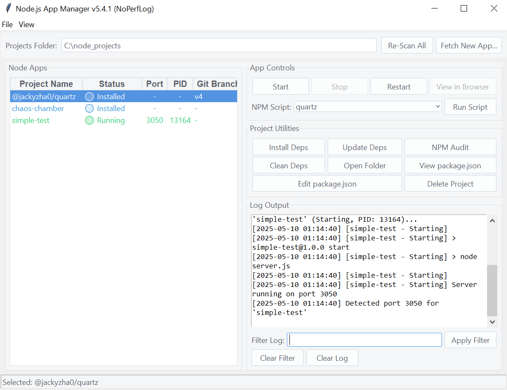

# Node.js App Manager

[](https://www.python.org/)
[](https://opensource.org/licenses/MIT) <!-- Or your chosen license -->
<!-- You can add more badges, e.g., for build status if you set up CI -->


A Python-based desktop GUI application for managing local Node.js projects, offering a XAMPP-like interface for common development tasks.

**⚠️ Note: Work in Progress & Experimental Software ⚠️**

Built and debugged with **Gemini 2.5 Pro Preview 05-06**.
This application is currently under active development and should be considered **experimental**.
While it aims to be a helpful tool, you may encounter bugs, unexpected behavior, or incomplete features.
**Use at your own risk, especially with critical project data.**
Please back up your projects before performing destructive operations like "Delete Project" or "Clean Dependencies."



## Overview

Node.js App Manager provides a convenient, centralized dashboard to discover, monitor, and interact with your local Node.js projects. If you're tired of juggling multiple terminal windows for starting, stopping, and running scripts for different Node.js applications, this tool aims to simplify your workflow.

Inspired by the ease-of-use of tools like XAMPP for PHP development, this application brings a similar level of control and visibility to your Node.js development environment.

## Why This App?

*   **Centralized Control:** Manage all your local Node.js projects from a single interface.
*   **Visual Feedback:** Quickly see which apps are running, on which ports, their PIDs, and even basic Git status.
*   **Simplified Operations:** Start, stop, restart, install dependencies, and run NPM scripts with button clicks.
*   **Discoverability:** Automatically scans a designated folder for Node.js projects.
*   **Workflow Enhancement:** Features like "Fetch New App" (from Git/NPM), "Create Basic Project," and "Edit package.json" streamline common developer tasks.

## Key Features

*   **Project Discovery:** Scans a projects folder for `package.json` files.
*   **Status Dashboard:** Displays projects with:
    *   Name, Status (Running, Stopped, Error, etc. with visual cues)
    *   Port, Process ID (PID)
    *   Current Git Branch
    *   Git Uncommitted Changes status (Yes/No)
*   **Application Controls:**
    *   Start / Stop / Restart selected app.
    *   View app in browser (if port detected).
    *   Run any NPM script defined in `package.json`.
*   **Project Utilities:**
    *   Install / Update / Clean dependencies (`npm install/update`, delete `node_modules`).
    *   Run `npm audit`.
    *   Open project folder in file explorer.
    *   View / Edit `package.json`.
    *   Delete project (with confirmation).
*   **Global Actions:**
    *   Fetch new app from Git URL or NPM package name.
    *   Create a new basic Node.js project structure.
    *   Re-scan all projects.
    *   Stop all currently running managed apps.
*   **User Interface:**
    *   XAMPP-like layout.
    *   Theming support (via `ttkthemes`).
    *   Integrated log viewer with filtering.
    *   Tooltips and status bar feedback.
    *   DPI awareness for sharper display.
*   **Configuration:** Persistent settings for projects folder and theme.

## Tech Stack

*   **Python 3:** Core language.
*   **Tkinter (`ttk`, `ttkthemes`):** For the graphical user interface.
*   **`psutil`:** For robust process management and inspection.
*   **`subprocess`:** For running external Node/NPM/Git commands.
*   **`pathlib`:** For modern, cross-platform path handling.

## Dependencies

*   Python 3.8+
*   `psutil`
*   `ttkthemes` (Optional, for enhanced visual styles. Falls back gracefully if not installed.)

You will also need **Node.js and NPM** installed and available in your system's PATH for the application to execute Node/NPM commands. **Git** must be installed and in your PATH for Git-related features to work.

## Installation & Setup

1.  **Clone the Repository:**
    ```bash
    git clone https://github.com/mikuaura/node-app-manager.git # Replace with your repo URL
    cd node-app-manager
    ```

2.  **Ensure Python 3 is Installed:**
    Verify you have Python 3.8 or newer.

3.  **Install Dependencies:**
    It's recommended to use a virtual environment:
    ```bash
    python -m venv venv
    source venv/bin/activate  # On Windows: venv\Scripts\activate
    ```
    Then install the required Python packages:
    ```bash
    pip install psutil ttkthemes
    ```
    (If you create a `requirements.txt` file, you can just do `pip install -r requirements.txt`)

4.  **Ensure Node.js, NPM, and Git are Installed:**
    Make sure `node`, `npm`, and `git` commands are accessible from your system's PATH.

## Running the Application

Navigate to the project's root directory (where `main.py` is located) and run:

```bash
python main.py
